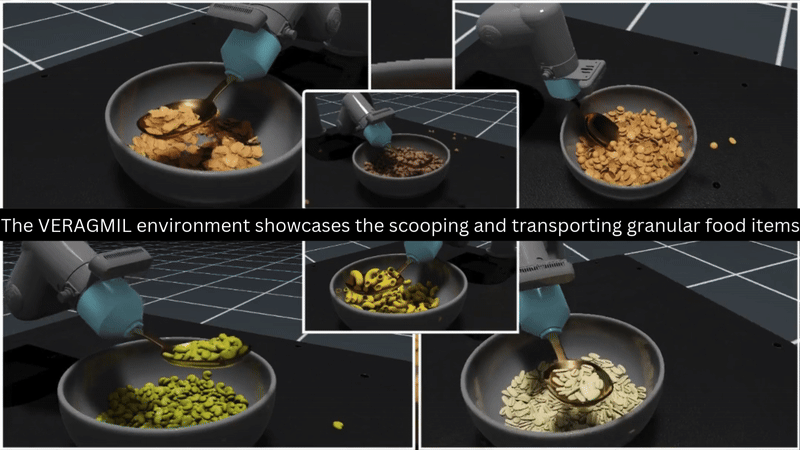

# VERAGMIL

**Learning robotic granular food manipulation from virtual reality demonstrations**

An imitation-learning framework for robot-assisted feeding.

[Project page](https://amanuelergogo.github.io/VERAGMIL/) · [IEEE](https://doi.org/10.1109/IROS60139.2025.11247362) · [arXiv](https://arxiv.org/abs/2608.18258)

> **VERAGMIL: Virtual Environment for Scooping Granular Foods with Imitation Learning Models**<br>
> Amanuel Ergogo, Diego Dall'Alba, and Przemyslaw Korzeniowski<br>
> 2025 IEEE/RSJ International Conference on Intelligent Robots and Systems (IROS), pages 13075–13082



VERAGMIL combines a high-fidelity, GPU-accelerated simulation with a virtual reality interface for collecting human demonstrations of granular-food scooping and transport. The framework supports imitation-learning experiments for robot-assisted feeding and evaluates policies through success rate, spillage, completion time, and generalization to unseen foods.

The paper compares Behavioral Cloning (BC), recurrent Behavioral Cloning (BC-RNN), and Batch-Constrained Q-learning (BCQ) using demonstrations collected through VR and a 3D space mouse. VR demonstrations produced stronger learned policies, while BCQ achieved the best overall performance.

## Citation

```bibtex
@inproceedings{ergogo2025veragmil,
  author    = {Ergogo, Amanuel and Dall'Alba, Diego and Korzeniowski, Przemyslaw},
  title     = {VERAGMIL: Virtual Environment for Scooping Granular Foods with Imitation Learning Models},
  booktitle = {2025 IEEE/RSJ International Conference on Intelligent Robots and Systems (IROS)},
  year      = {2025},
  pages     = {13075--13082},
  doi       = {10.1109/IROS60139.2025.11247362}
}
```

The project website is served from [`docs/`](docs/) using GitHub Pages.
